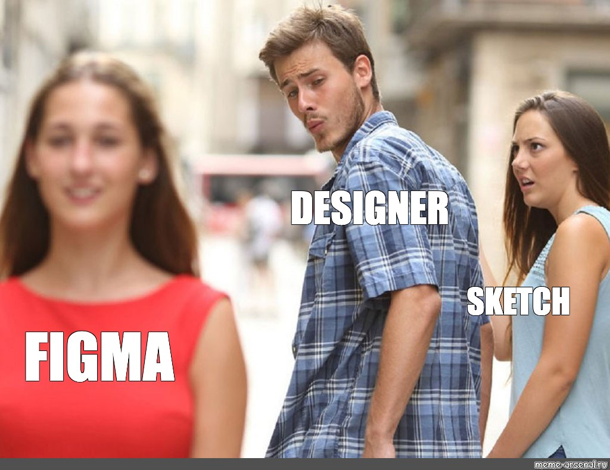

# Day 04

## UI x UX 

### Figma 

Figma is a cloud-based design tool that allows users to create user interface (UI) designs, user experience (UX) designs, wireframes, prototypes, and graphics for websites, mobile applications, and other digital products. It was developed by Figma Inc. and released in 2016. Figma enables real-time collaboration and sharing of design files, allowing multiple designers to work together on the same project simultaneously. It also includes features such as version history, design components, and a powerful prototyping tool. Figma has gained popularity among designers due to its ease of use, flexibility, and collaborative features, making it a popular choice for both individual designers and design teams.

Figma that cover various aspects related to design, UI/UX, and the process of building a website:

#### Why do we need Design?
- Good design can improve the usability and functionality of a product or service.
- It helps to create a positive user experience and can increase customer satisfaction and loyalty.
- Design can also differentiate a brand from its competitors and help to establish a strong brand identity.

### Difference between UI/UX
- User Interface (UI) refers to the visual and interactive elements of a product or service, such as buttons, menus, and forms.
- User Experience (UX) encompasses the entire user journey, including how users perceive, feel, and interact with a product or service.

#### Process of building a website
- Wireframing: Creating a basic layout of the website's content and functionality.
- Mockup: Adding more detail and design to the wireframe to create a high-fidelity representation of the website's visual design.
- Design: Refining the mockup and preparing the assets for development.

#### Why Figma, how to use Figma
- Figma is a cloud-based design tool that allows for collaboration and sharing of design files.
- It offers features such as real-time collaboration, version history, and prototyping.
- To use Figma, simply create an account, create or upload a design file, and start designing!

#### Basic tools of Figma
- Selection tool: Allows you to select and manipulate objects on the canvas.
- Text tool: Used to add and edit text on the canvas.
- Shape tools: Allows you to create various shapes and adjust their properties.
- Pen tool: Used to create custom shapes and paths.
- Prototype tool: Allows you to create interactive prototypes and animations.

#### Home page of Google
- Wireframe: Basic layout of the search bar and buttons.
- Mockup: Adding more detail to the search bar and buttons, incorporating the Google logo and additional links.
- Design: Refining the visual design, including the color scheme, typography, and layout.

#### Creating wireframe in Figma
- To create a wireframe in Figma, start by creating a new file and selecting the "Wireframe" template.
- Use the shape tools to create basic shapes for the different elements of the website, such as the header, navigation, and content areas.
- Add placeholder text and images to give an idea of the content that will be displayed on the website.
- Use the text tool to add labels and annotations to the wireframe to provide more information for the design team.

#### Creating a mockup in Figma
- To create a mockup in Figma, start by importing the wireframe into a new file.
- Use the design tools to add more detail to the wireframe, including typography, color scheme, and visual hierarchy.
- Incorporate images and graphics to create a high-fidelity representation of the website's visual design.
- Use the prototype tool to add interactivity to the mockup, such as clickable buttons and links.

#### Designing in Figma
- To design in Figma, start by refining the mockup and preparing the assets for development.
- Use the design tools to fine-tune the visual design, such as adjusting color values, typography, and spacing.
- Use the components feature to create reusable design elements, such as buttons and icons.
- Collaborate with the development team to ensure that the design is feasible and meets the project requirements.

Overall, Figma is a powerful and versatile design tool that can be used for wireframing, mockups, and design. Its cloud-based platform makes it easy to collaborate with other team members and share design files. By using Figma, designers can create high-quality designs that meet the needs of their clients and users.