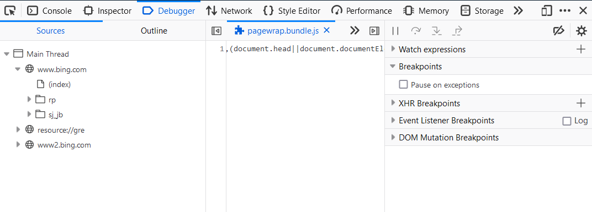
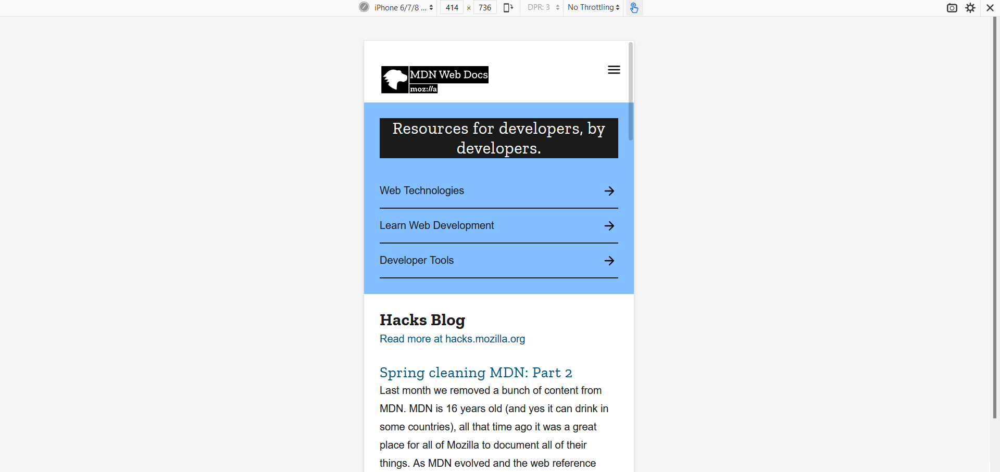

# Day 01 

# What is the Internet?
The internet is simply a network of computers that communicate with each other to send and receive data (information).

Each of these computers on the internet can be distinguished and located by a unique number called an IP Address. An IP Address looks something like this: 168.212.226.204

# What is the Web?
The Web is a subset of the internet.

Like every other computer network out there, the Web is made up of two main components: the web browser client and the web server.

The client requests the data and the server shares or serves its data. To achieve this, the two parties have to establish an agreement. That agreement is called the Application Programming Interface or in short, the API.

But this data has to be arranged and formatted into a form that's understandable by end-users who have a wide range of technical experiences and abilities.

This is where HTML, CSS, JavaScript and the whole concept of web development come into play.


# Web Terminology
1. HTML (HyperText Markup Language) - the "programming" language used to write web pages
2. Source file - the set of tags and text which make up a web page. Browsers process the source file to make the web page look the way the designer wanted it to look.
3. URL (Uniform Resource Locator) - a web address; indicates the location of a web resource as well as the protocol needed to access it
4. Protocol - ground rules or "language" that internet computers use to "talk" with each other
5. HTTP (HyperText Transfer Protocol) - the internet protocol which allows web pages to work
6. FTP (File Transfer Protocol) - allows computers to exchange files over a network
7. Web page - a single page on the web (a "homepage" is the first web page on a web site)
8. Web site - a collection of web pages, usually on a particular topic or business
9. Web browser/navigator/client - the software application which displays web pages
10. Web server - the computer or network of computers which stores web pages

# Browser Features

## Page Inspector


View and edit page content and layout. Visualize many aspects of the page including the box model, animations, and grid layouts

## Web Console


See messages logged by a web page and interact with the page using JavaScript.

## JavaScript Debugger


Stop, step through, and examine the JavaScript running on a page.

## Network Monitor


See the network requests made when a page is loaded.

## Responsive Design Mode


See how your website or app will look and behave on different devices and network types.

# What is HTML

## Origin of HTML

HTML, or Hypertext Markup Language, is the standard language used for creating web pages. HTML was first created by Tim Berners-Lee in the late 1980s while working at CERN, the European Organization for Nuclear Research in Switzerland. At the time, he was looking for a way to allow scientists to share information more easily over the internet.

The first version of HTML, called HTML 1.0, was released in 1991. It was a very basic language that allowed users to create simple web pages with headings, paragraphs, and lists. Over the years, HTML has evolved and new versions have been released with more advanced features and capabilities.

HTML 2.0 was released in 1995 and included more formatting options, such as tables and images. HTML 3.2, released in 1997, added even more formatting options and support for stylesheets, which allowed web designers to separate the presentation of a web page from its content.

HTML 4.0, released in 1998, was a major update to the language and introduced a number of new features, including support for frames and cascading style sheets (CSS). CSS allowed designers to control the layout and appearance of web pages in a more sophisticated way.

HTML 5, the latest version of HTML, was released in 2014. It includes many new features and improvements, such as support for video and audio, new semantic tags, and enhanced accessibility options.

Overall, HTML has played a critical role in the development of the World Wide Web and continues to be an essential tool for creating and publishing content on the internet.

## Lets move to practical Knowledge.

HTML is a markup language that defines the structure of your content. HTML consists of a series of elements, which you use to enclose, or wrap, different parts of the content to make it appear a certain way, or act a certain way. The enclosing tags can make a word or image hyperlink to somewhere else, can italicize words, can make the font bigger or smaller, and so on. For example, take the following line of content:

```
My cat is very grumpy
```

If we wanted the line to stand by itself, we could specify that it is a paragraph by enclosing it in paragraph tags:

```hmtl
<p>My cat is very grumpy</p>
```

