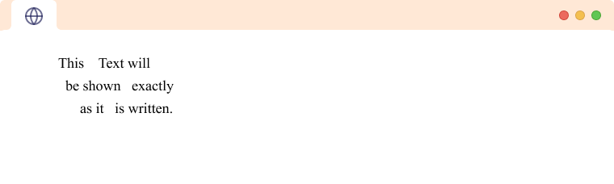
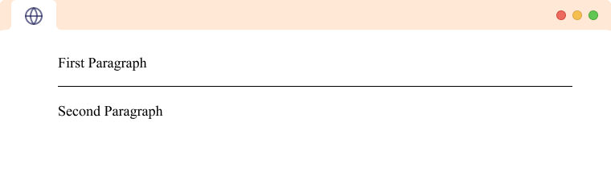

# Day 06

## Web-Introduction

# What is the Internet?
The internet is simply a network of computers that communicate with each other to send and receive data (information).

Each of these computers on the internet can be distinguished and located by a unique number called an IP Address. An IP Address looks something like this: 168.212.226.204

# What is the Web?
The Web is a subset of the internet.

Like every other computer network out there, the Web is made up of two main components: the web browser client and the web server.

The client requests the data and the server shares or serves its data. To achieve this, the two parties have to establish an agreement. That agreement is called the Application Programming Interface or in short, the API.

But this data has to be arranged and formatted into a form that's understandable by end-users who have a wide range of technical experiences and abilities.

This is where HTML, CSS, JavaScript and the whole concept of web development come into play.


# Frontend-Backend ?

Front-end and back-end are two distinct parts of a web application. The front-end, also known as the client-side, is the user-facing part of the web application that is visible to the user in their web browser. The back-end, also known as the server-side, is the behind-the-scenes part of the web application that processes requests and generates responses to the client.

The front-end typically consists of HTML, CSS, JavaScript, and other client-side technologies that are used to create the user interface and control the behavior of the web application. This includes things like buttons, forms, dropdowns, animations, and other interactive elements that users can see and interact with.

The back-end typically consists of server-side programming languages like Java, Python, or PHP, web frameworks like Node.js, Ruby on Rails, or Django, and databases like MySQL or MongoDB. The back-end is responsible for processing client requests, retrieving data from the database, and generating responses that are sent back to the client.

In summary, the front-end is the part of the web application that users see and interact with, while the back-end is the part that is responsible for processing requests, managing data, and generating responses. Both front-end and back-end work together to create a functional and user-friendly web application.


# 3 Tier Architechture

Client:
A client is a computer application or program that requests services or resources from a server over a network. In the context of web development, a client typically refers to the front-end part of a web application that runs in a user's web browser. The purpose of the client is to provide an interface for users to interact with the web application. The set of technology used in the client can vary depending on the specific needs of the web application. This may include HTML, CSS, JavaScript, and other web technologies.

When you type google.com in your web browser, the client sends a request to the server to fetch the website's resources such as HTML, CSS, JavaScript files, and images. The server then responds to the client's request by sending the website's resources back to the client. The client then uses these resources to render the website in the user's web browser.

Server:
A server is a computer or software program that provides services or resources to other computers or applications over a network. In the context of web development, a server typically refers to the back-end part of a web application that runs on a remote computer and provides data and services to the client. The purpose of the server is to process client requests and return appropriate responses. The set of technology used in the server can vary depending on the specific needs of the web application. This may include programming languages like Java, Python, or PHP, web frameworks like Node.js, Ruby on Rails, or Django, and databases like MySQL or MongoDB.

Database:
A database is a software program that stores and manages data in an organized manner. In the context of web development, a database is typically used as part of the back-end of a web application to store and manage data that is needed by the application. The purpose of the database is to provide a structured and organized way to store data so that it can be easily retrieved and used by the web application. The set of technology used in the database can vary depending on the specific needs of the web application. This may include relational databases like MySQL or PostgreSQL, NoSQL databases like MongoDB or Cassandra, and object-oriented databases like db4o.


# DSA In web Development

DSA, or Data Structures and Algorithms, are essential for web development, as they enable developers to create efficient and scalable web applications. Here are some examples of how DSA can be used in web development:

- Arrays and Linked Lists: Arrays and linked lists are used to store and manipulate data in web applications. For example, arrays are commonly used to store user input data in forms, while linked lists can be used to represent hierarchical data structures such as menus.

- Hash Tables: Hash tables are used to store key-value pairs in web applications. They are commonly used for caching, session management, and database indexing.

- Graphs: Graphs are used to represent complex relationships between data in web applications. For example, social media platforms use graphs to represent connections between users and their friends.

- Sorting and Searching: Sorting and searching algorithms are used to efficiently find and retrieve data from large datasets in web applications. For example, a search engine uses algorithms such as binary search to quickly find relevant search results for a given query.

Overall, the use of DSA in web development allows for efficient and scalable web applications that can handle large amounts of data and provide a seamless user experience.

##  Web Terminology
1. HTML (HyperText Markup Language) - the "programming" language used to write web pages
2. Source file - the set of tags and text which make up a web page. Browsers process the source file to make the web page look the way the designer wanted it to look.
3. URL (Uniform Resource Locator) - a web address; indicates the location of a web resource as well as the protocol needed to access it
4. Protocol - ground rules or "language" that internet computers use to "talk" with each other
5. HTTP (HyperText Transfer Protocol) - the internet protocol which allows web pages to work
6. FTP (File Transfer Protocol) - allows computers to exchange files over a network
7. Web page - a single page on the web (a "homepage" is the first web page on a web site)
8. Web site - a collection of web pages, usually on a particular topic or business
9. Web browser/navigator/client - the software application which displays web pages
10. Web server - the computer or network of computers which stores web pages

# Browser Features

## Page Inspector


View and edit page content and layout. Visualize many aspects of the page including the box model, animations, and grid layouts

## Web Console


See messages logged by a web page and interact with the page using JavaScript.

## JavaScript Debugger


Stop, step through, and examine the JavaScript running on a page.

## Network Monitor


See the network requests made when a page is loaded.

## Responsive Design Mode


See how your website or app will look and behave on different devices and network types.

# What is HTML

## Origin of HTML

HTML, or Hypertext Markup Language, is the standard language used for creating web pages. HTML was first created by Tim Berners-Lee in the late 1980s while working at CERN, the European Organization for Nuclear Research in Switzerland. At the time, he was looking for a way to allow scientists to share information more easily over the internet.

The first version of HTML, called HTML 1.0, was released in 1991. It was a very basic language that allowed users to create simple web pages with headings, paragraphs, and lists. Over the years, HTML has evolved and new versions have been released with more advanced features and capabilities.

HTML 2.0 was released in 1995 and included more formatting options, such as tables and images. HTML 3.2, released in 1997, added even more formatting options and support for stylesheets, which allowed web designers to separate the presentation of a web page from its content.

HTML 4.0, released in 1998, was a major update to the language and introduced a number of new features, including support for frames and cascading style sheets (CSS). CSS allowed designers to control the layout and appearance of web pages in a more sophisticated way.

HTML 5, the latest version of HTML, was released in 2014. It includes many new features and improvements, such as support for video and audio, new semantic tags, and enhanced accessibility options.

Overall, HTML has played a critical role in the development of the World Wide Web and continues to be an essential tool for creating and publishing content on the internet.

## Lets move to practical Knowledge.

HTML is a markup language that defines the structure of your content. HTML consists of a series of elements, which you use to enclose, or wrap, different parts of the content to make it appear a certain way, or act a certain way. The enclosing tags can make a word or image hyperlink to somewhere else, can italicize words, can make the font bigger or smaller, and so on. For example, take the following line of content:

```
My cat is very grumpy
```

If we wanted the line to stand by itself, we could specify that it is a paragraph by enclosing it in paragraph tags:

```hmtl
<p>My cat is very grumpy</p>
```


## Hierarchy


The main parts of our element are as follows:

1. The opening tag: This consists of the name of the element (in this case, p), wrapped in opening and closing angle brackets. This states where the element begins or starts to take effect — in this case where the paragraph begins.

2. The closing tag: This is the same as the opening tag, except that it includes a forward slash before the element name. This states where the element ends — in this case where the paragraph ends. Failing to add a closing tag is one of the standard beginner errors and can lead to strange results.

3. The content: This is the content of the element, which in this case, is just text.

4. The element: The opening tag, the closing tag, and the content together comprise the element.


# HTML Basics

## Nesting elements
You can put elements inside other elements too — this is called nesting. If we wanted to state that our cat is very grumpy, we could wrap the word "very" in a ```<strong>``` element, which means that the word is to be strongly emphasized:

```html
<p>My cat is <strong>very</strong> grumpy.</p>
```

You do however need to make sure that your elements are properly nested. In the example above, we opened the ```<p>``` element first, then the ```<strong>``` element; therefore, we have to close the ```<strong>``` element first, then the ```<p> ```element. The following is incorrect:

```html
<p>My cat is <strong>very grumpy.</p></strong>
```

The elements have to open and close correctly so that they are clearly inside or outside one another. If they overlap as shown above, then your web browser will try to make the best guess at what you were trying to say, which can lead to unexpected results. So don't do it!

## Empty elements
Some elements have no content and are called empty elements. Take the `````` element that we already have in our HTML page:

```html

```
This contains two attributes, but there is no closing ```</img>``` tag and no inner content. This is because an image element doesn't wrap content to affect it. Its purpose is to embed an image in the HTML page in the place it appears.

**Note:** The src,alt in img tag are known as attributes. so let's see what attributes are:

## Attributes


Attributes contain extra information about the element that you don't want to appear in the actual content. Here, class is the attribute name and editor-note is the attribute value. The class attribute allows you to give the element a non-unique identifier that can be used to target it (and any other elements with the same class value) with style information and other things.

An attribute should always have the following:

1. A space between it and the element name (or the previous attribute, if the element already has one or more attributes).

2. The attribute name followed by an equal sign.
3. The attribute value wrapped by opening and closing quotation marks.

# Marking up text
This section will cover some of the essential HTML elements you'll use for marking up the text.


## Paragraphs
As explained above, <p> elements are for containing paragraphs of text; you'll use these frequently when marking up regular text content:

```html
<p>This is a single paragraph</p>
Add your sample text (you should have it from What will your website look like?) into one or a few paragraphs, placed directly below your  element.
```

## Headings

In this tutorial, you will learn about HTML headings, ```<h1> to <h6>```, and their implementation with the help of examples.

The HTML heading tags ```(<h1> to <h6>)``` are used to add headings to a webpage. For example,

```html
<h1>This is heading 1.</h1>
<h2>This is heading 2.</h2>
<h3>This is heading 3.</h3>
<h4>This is heading 4.</h4>
<h5>This is heading 5.</h5>
<h6>This is heading 6.</h6>
```


In the example, we have used tags ```<h1> to <h6>``` to create headings of varying sizes and importance.

The ```<h1>``` tag denotes the most important heading on a webpage. Similarly, ````<h6>```` denotes the least important heading.

The difference in sizes of heading tags comes from the browser's default styling. And, you can always change the styling of heading tags, including font size, using CSS.

## HTML Comments 

In this tutorial, you will learn about HTML comments with the help of examples.
The HTML comments are used to add extra information to a web page. For example,

```html
<!-- this is a HTML comment. -->
```

The HTML Comment tag (<!-- comment here -->) is used to insert text to the webpage which is not rendered by the browser.

The HTML comments can be seen while reading the code but get ignored by the browser during the rendering of the page. For example,

```html
  <!-- a random comment.  -->
  <p>HTML is fun to learn.</p>
  ```
### Keyboard Shortcut for HTML Comments

Most code editors have a keyboard shortcut for commenting code.

In general, most code editors use Ctrl + / (on Windows or Linux) and Cmd + / (on Mac) for creating comments.

We encourage you to remember these shortcuts as comments are used frequently to add extra information as well as to temporarily remove certain code.

# HTML Line Break

In this tutorial, you will learn about the HTML Line Break with the help of examples.

The HTML Line Break tag is used to apply a line break and start your text in the new line.

In HTML, we use the ```<br>``` tag to create a line break. For example,

```html
<p>
  Use the <br> br tag <br> to create line breaks in text.
</p>
```

In the above code, if you look carefully, you can find there is no closing tag for ```<br>.``` It's because the ```<br>``` tag is an empty tag, which means it doesn't require a closing tag.

As you can see, the ```<br>``` tag adds a new line without having to create a new paragraph.

The line break is helpful for writing structured texts like addresses and poems without creating multiple paragraphs.

## HTML Pre-Tag

In this tutorial, you will learn about the HTML ```<pre>``` tag with the help of examples.

The HTML Preformatted text tag,``` <pre>,``` is used to define a block of text to display them in the same manner as it is written in the HTML file.

In HTML, we use the ```<pre>``` tag to create preformatted text. For example,

```html
<pre>
  This    Text will 
  be shown   exactly 
      as it   is written.
</pre>
```


The ```<pre>``` tag preserves all new lines and white spaces. Hence, the above example shows the output exactly as it is written.

## HTML Horizontal Rule

In this tutorial, you will learn about the HTML ```<hr>``` tag with the help of examples.
The HTML Horizontal rule tag, ```<hr>```, is used to insert a horizontal line between our paragraphs. For example,

```html
  <p>First Paragraph</p>
  <hr>
  <p>Second Paragraph</p>
  ```


The ```<hr> ```tag is an empty tag, i.e. it doesn't require a closing tag.

# Links
Links are very important — they are what makes the web a web! To add a link, we need to use a simple element — ``<a>`` — "a" being the short form for "anchor". To make text within your paragraph into a link, follow these steps:

Choose some text. We chose the text "Mozilla Manifesto".
Wrap the text in an ``<a>`` element, as shown below:
```html
<a>Mozilla Manifesto</a>
```

Give the ``<a>`` element an href attribute, as shown below:
```html
<a href="">Mozilla Manifesto</a>
```

Fill in the value of this attribute with the web address that you want the link to:
```html
<a href="https://www.mozilla.org/en-US/about/manifesto/">Mozilla Manifesto</a>
```

You might get unexpected results if you omit the https:// or http:// part, called the protocol, at the beginning of the web address. After making a link, click it to make sure it is sending you where you wanted it to.

# List
A lot of the web's content is lists and HTML has special elements for these. Marking up lists always consists of at least 2 elements.In HTML, there are three types of lists: ordered lists, unordered lists, and descriptive lists.Below is an overview for the same 

Ordered Lists:
```html
<ol>
    <li>item-1</li>
    <li>item-2</li>
    <li>item-3</li>
</ol>
```
1. An ordered list is a list of items that are ordered numerically or alphabetically. It is created using the ``<ol>`` tag.
Each item in the list is represented by the ``<li>`` tag.
The attributes used in ordered lists include:
"start": specifies the starting number of the list.
"type": specifies the type of numbering used, such as decimal, uppercase letters, or lowercase Roman numerals.
"reversed": reverses the numbering of the list.

```html
<ul>
    <li>item-1</li>
    <li>item-2</li>
    <li>item-3</li>
</ul>
```
2. Unordered Lists:
An unordered list is a list of items that are not ordered in any particular way. It is created using the ``<ul>`` tag.
Each item in the list is represented by the ``<li>`` tag.
The attributes used in unordered lists include:
"type": specifies the type of bullet point used, such as circle, square, or disc.

```html
<dl>
    <dt>Title</dt>
    <dd>description</dd>
</dl>
```
3. Descriptive Lists:
A descriptive list is a list of items that are paired with their descriptions. It is created using the <dl> tag.
Each item in the list is represented by the <dt> tag, and the description is represented by the <dd> tag.
The attributes used in descriptive lists include:
None.


=======
# Project
Now lets make a resume with the help of html

```html
<!DOCTYPE html>
<html lang="en">
  <head>
    <meta charset="UTF-8" />
    <meta http-equiv="X-UA-Compatible" content="IE=edge" />
    <meta name="viewport" content="width=device-width, initial-scale=1.0" />
    <title>Document</title>
  </head>
  <body>
    <h1>Bittoo Aggarwal</h1>
    <p>Software Developer, Educator at Geekster</p>
    <a href="https://www.linkedin.com/in/bittoo-aggarwal/">Linkedin</a>
    <a href="https://github.com/bitz1119">Github</a>
    <hr />
    <h2>Experience</h2>
    <h3>Software developer at Amazon</h3>
    <p>
      I work with amazon in transportation team, some more description Lorem
      ipsum dolor sit amet consectetur adipisicing elit. Possimus, ullam! Maxime
      officiis consequuntur libero eaque reprehenderit quisquam nam ab vitae
      totam id commodi laborum enim, sint ea odit quasi soluta!
      <br />
      Lorem ipsum dolor sit, amet consectetur adipisicing elit. Provident iusto
      ut praesentium modi. Incidunt atque voluptatem, dignissimos officiis
      reprehenderit est!
    </p>
    <hr />

    <h3>Educator at Geekster</h3>
    <p>
      Lorem, ipsum dolor sit amet consectetur adipisicing elit. Tempora cum
      inventore aliquam, nulla eos dignissimos ipsum voluptas id, dolores
      suscipit totam nostrum perferendis alias, expedita quaerat distinctio
      asperiores! Nobis, aliquid. Lorem ipsum dolor sit amet consectetur
      adipisicing elit. Facere ipsa ab qui autem nesciunt vel consequatur non
      totam, temporibus excepturi voluptatem iure impedit ut repellendus earum
      necessitatibus nemo eligendi, animi debitis reiciendis suscipit. Unde iure
      obcaecati dolores, numquam quibusdam rerum facilis a quam quos ad ullam
      consectetur reiciendis deserunt similique.
    </p>
    <hr />

    <h2>Skills</h2>
    <!-- how to comment -->
    <!-- I want to add skills list -->
    <ul>
      <li>Java</li>
      <li>JavaScript</li>
      <li>Testing</li>
      <li>API Designing</li>
      <li>System Design</li>
    </ul>

    <hr />
    <h2>Hobbies</h2>
    <ol>
      <li>Table Tennis</li>
      <li>Reading Books</li>
      <li>Biography</li>
      <li>Teaching</li>
    </ol>
    <hr />
    <h2>Projects</h2>
    <dl>
      <dt>Project-1</dt>
      <dd>
        Lorem ipsum dolor sit amet, consectetur adipisicing elit. Ex, provident?
        Voluptatem quos dignissimos velit quia, assumenda molestiae hic,
        maiores, corporis a tempore perferendis repellendus quod modi non quo
        ipsam laboriosam consectetur voluptates quibusdam facilis nisi unde
        libero? Pariatur, recusandae aspernatur.
      </dd>
      <dt>Project-2</dt>
      <dd>
        Lorem ipsum dolor sit amet, consectetur adipisicing elit. Ex, provident?
        Voluptatem quos dignissimos velit quia, assumenda molestiae hic,
        maiores, corporis a tempore perferendis repellendus quod modi non quo
        ipsam laboriosam consectetur voluptates quibusdam facilis nisi unde
        libero? Pariatur, recusandae aspernatur.
      </dd>
    </dl>
    <hr>
    <pre>
        Contact Details 
        Email:abc@gamil.com 
        Mobile no. :8448xxxx18
    </pre>
  </body>
</html>
```

Above Resume will look like this on browser,


