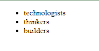
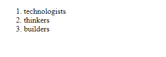
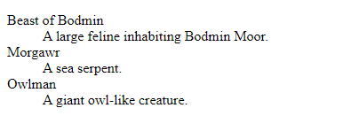

# Day 02

## Lists
A lot of the web's content is lists and HTML has special elements for these. Marking up lists always consists of at least 2 elements. The most common list types are ordered, unordered lists, description list:

1. Unordered lists are for lists where the order of the items doesn't matter, such as a shopping list. These are wrapped in a ``<ul>`` element.

2. Ordered lists are for lists where the order of the items does matter, such as a recipe. These are wrapped in an ``<ol>`` element.

3. The ``<dl>`` HTML element represents a description list. The element encloses a list of groups of terms (specified using the <dt> element) and descriptions (provided by <dd> elements). Common uses for this element are to implement a glossary or to display metadata (a list of key-value pairs).

Each item inside the lists is put inside an ``<li> ``(list item) element.

For example, if we wanted to turn the part of the following paragraph fragment into a list

```html
<p>At Mozilla, we're a global community of technologists, thinkers, and builders working together… </p>
```
We could modify the markup to this

```html
<p>Example of unordered list</p>

<ul>
  <li>technologists</li>
  <li>thinkers</li>
  <li>builders</li>
</ul>

```
Below is the output for for above list 👇



```html
<p>Example of ordered list</p>
<ol>
  <li>technologists</li>
  <li>thinkers</li>
  <li>builders</li>
</ol>
```
Below is the output for for above list 👇


```html
<p>Example of dl list</p>

<dl>
    <dt>Beast of Bodmin</dt>
    <dd>A large feline inhabiting Bodmin Moor.</dd>

    <dt>Morgawr</dt>
    <dd>A sea serpent.</dd>

    <dt>Owlman</dt>
    <dd>A giant owl-like creature.</dd>
</dl>
```
Below is the output for for above list 👇




# Links
Links are very important — they are what makes the web a web! To add a link, we need to use a simple element — ``<a>`` — "a" being the short form for "anchor". 

## Synatx

Give the ``<a>`` element an href attribute, as shown below:
```html
<a href="">Mozilla Manifesto</a>
```

Fill in the value of this attribute with the web address that you want the link to:
```html
<a href="https://www.mozilla.org/en-US/about/manifesto/">Mozilla Manifesto</a>
```


You might get unexpected results if you omit the https:// or http:// part, called the protocol, at the beginning of the web address. After making a link, click it to make sure it is sending you where you wanted it to.

## Types of Navigation
1. Inter Navigation-The above exapmple discussed was related to Inter navigation. So we can use clickable elements that allow users to navigate to other pages or resources on the web. To create a hyperlink in HTML, you use the ``<a>`` tag and set the href attribute to the URL of the page you want to link to.


```html
<a href="https://www.geekster.in/">About</a>
```


2. Intra Navigation - An anchor is a point within a web page that can be targeted by a link. To create an anchor, you can use the id attribute on any HTML element. For example, to create an anchor at the beginning of a section, you could use:

```html
<section id="my-section">
  <!-- content of section here -->
</section>
```
To link to this anchor from another part of the same page, you can use an anchor link. An anchor link is simply a regular link with the href attribute set to the # symbol followed by the id of the anchor. For example:

```html
<a href="#my-section">Go to my section</a>
```
When the user clicks on this link, the browser will scroll to the section with the id "my-section".


# Images 
The ```` tag in HTML is used to insert images into a web page. It is a self-closing tag, which means that it does not require a closing tag.

The ```` tag has a required src attribute, which specifies the URL of the image to be displayed. For example:

```html

```

The alt attribute is also required and should provide a text description of the image for users who cannot see it or have images turned off in their browser. It is also used by screen readers for accessibility purposes.

In addition to the src and alt attributes, there are several optional attributes that can be used with the ```` tag, including:

- width and height: These attributes specify the width and height of the image in pixels.

- title: This attribute provides additional information about the image that is displayed when the user hovers over it.

- loading: This attribute tells the browser how to load the image, with possible values of "lazy" or "eager". "Lazy" means the image will be loaded only when

# Assignment
- https://priyanshu-240499.github.io/Assignments-CSS/html_day2/day2.html


# Tables in HTML 

<table> element in HTML:

Frame: Specifies whether to display borders around the table and its cells. Possible values are "void" (no borders), "above" (borders above the table), "below" (borders below the table), "hsides" (borders on the top and bottom of the table), "vsides" (borders on the left and right of the table), "lhs" (border on the left-hand side of the table), "rhs" (border on the right-hand side of the table), and "box" (borders on all sides of the table). Example: ```<table frame="hsides">.```

Rules: Specifies which parts of the table have borders. Possible values are "none" (no borders), "groups" (borders around groups of rows or columns), "rows" (borders between each row), and "cols" (borders between each column). Example: ```<table rules="rows">.```

Border: Specifies the width of the border(s) around the table and its cells. Example: ```<table border="1">.```

Cellpadding: Specifies the amount of space between the cell content and the cell border. Example:```` <table cellpadding="10">.````

Cellspacing: Specifies the amount of space between cells. Example: ```<table cellspacing="5">.```

Colspan: Specifies the number of columns a cell should span. Example: ```<td colspan="2">.```

Rowspan: Specifies the number of rows a cell should span. Example: ```<td rowspan="3">.```

These attributes can be used individually or in combination to customize the appearance of tables in HTML.


```html
<!DOCTYPE html>
        <html>
        <head>
            <meta charset="utf-8">
            <meta name="description" content="">
            <meta name="keywords" content="">
            <title>Table Practice</title>
        </head>
        <body>
            <table border="1" align="center" cellpadding="10px">
                <thead>
                    <tr>
                        <th rowspan="3">Day</th>
                        <th colspan="3">Seminar</th>
                    </tr>
                    <tr>
                        <th colspan="2">Schedule</th>
                        <th rowspan="2">Topic</th>
                    </tr>
                    <tr>
                        <th>Begin</th>
                        <th>End</th>
                    </tr>
                </thead>
        
                <tbody>
                    <tr>
                        <td rowspan="2">Monday</td>
                        <td rowspan="2">8:00 a.m</td>
                        <td rowspan="2">5:00 p.m</td>
                        <td>Introduction to XML</td>
                    </tr>
                    <tr>
                        <td>Validity: DTD and Relax NG</td>
                    </tr>
                    <tr>
                        <td rowspan="4">Tuesday</td>
                        <td>8:00 a.m</td>
                        <td>11:00 a.m</td>
                        <td rowspan="2">XPath</td>
                    </tr>
                    <tr>
                        <td rowspan="2">11:00 a.m</td>
                        <td rowspan="2">2:00 p.m</td>
                    </tr>
                    <tr>
                        <td rowspan="2">XSL transformation</td>
                    </tr>
                    <tr>
                        <td>2:00 p.m</td>
                        <td>5:00 p.m</td>
                    </tr>
                    <tr>
                        <td>Wednesday</td>
                        <td>8:00 a.m</td>
                        <td>12:00 p.m</td>
                        <td>XLS Formatting Objects</td>
                    </tr>
        
                </tbody>
            </table>
        
        </body>
        </html>
        ```
