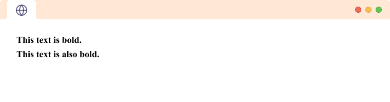

# Day 07

# Block vs Inline HTML

In HTML, elements are classified as either block-level or inline elements based on their behavior and how they are displayed on the web page.

Block-level elements are displayed as a block on the page, taking up the full width available to them and creating a new line after the element. They are typically used for larger pieces of content, such as headings, paragraphs, and lists.

Example of block-level element:

```html
<div>
  <h1>Heading 1</h1>
  <p>This is a paragraph of text.</p>
  <ul>
    <li>List item 1</li>
    <li>List item 2</li>
    <li>List item 3</li>
  </ul>
</div>
```

In this example, the ```<div>``` element is a block-level element, and it contains other block-level elements such as ```<h1>, <p>, and <ul>.``` When the page is rendered, each of these elements will be displayed as a block, taking up the full width of the container element, and creating a new line after each one.

Inline elements, on the other hand, are displayed inline with the surrounding content, without creating a new line after the element. They are typically used for smaller pieces of content, such as links, images, and text formatting.

Example of inline element:

```html
<p>This is a paragraph with a <strong>strong</strong> and <em>emphasized</em> text.</p>
```

In this example, the ```<strong> and <em>``` elements are inline elements, and they are used to add emphasis to certain words within the paragraph. When the page is rendered, these elements will be displayed inline with the surrounding text, without creating a new line.

It's important to note that some elements, such as ```<span> and <a>```, can be either block-level or inline, depending on how they are used and whether they are given a specific width or height.

# Inline tags

## Links

Give the ``<a>`` element an href attribute, as shown below:
```html
<a href="">Mozilla Manifesto</a>
```

Fill in the value of this attribute with the web address that you want the link to:
```html
<a href="https://www.mozilla.org/en-US/about/manifesto/">Mozilla Manifesto</a>
```


You might get unexpected results if you omit the https:// or http:// part, called the protocol, at the beginning of the web address. After making a link, click it to make sure it is sending you where you wanted it to.

## Types of Navigation
1. Inter Navigation-The above exapmple discussed was related to Inter navigation. So we can use clickable elements that allow users to navigate to other pages or resources on the web. To create a hyperlink in HTML, you use the ``<a>`` tag and set the href attribute to the URL of the page you want to link to.


```html
<a href="https://www.geekster.in/">About</a>
```


2. Intra Navigation - An anchor is a point within a web page that can be targeted by a link. To create an anchor, you can use the id attribute on any HTML element. For example, to create an anchor at the beginning of a section, you could use:

```html
<section id="my-section">
  <!-- content of section here -->
</section>
```
To link to this anchor from another part of the same page, you can use an anchor link. An anchor link is simply a regular link with the href attribute set to the # symbol followed by the id of the anchor. For example:

```html
<a href="#my-section">Go to my section</a>
```
When the user clicks on this link, the browser will scroll to the section with the id "my-section".


# Images 
The ```` tag in HTML is used to insert images into a web page. It is a self-closing tag, which means that it does not require a closing tag.

The ```` tag has a required src attribute, which specifies the URL of the image to be displayed. For example:

```html

```

The alt attribute is also required and should provide a text description of the image for users who cannot see it or have images turned off in their browser. It is also used by screen readers for accessibility purposes.

In addition to the src and alt attributes, there are several optional attributes that can be used with the ```` tag, including:

- width and height: These attributes specify the width and height of the image in pixels.

- title: This attribute provides additional information about the image that is displayed when the user hovers over it.

- loading: This attribute tells the browser how to load the image, with possible values of "lazy" or "eager". "Lazy" means the image will be loaded only when


## HTML Bold 

In this tutorial, we will learn about implementing bold text in HTML with the help of examples.

We use the HTML ```<b>``` tag or the HTML ```<strong>``` tag to make text bold. For example,

```html
<b>This text is bold.</b>
<br>
<strong>This text is also bold.</strong>
```




### Bold v/s Strong

Both ```<b> and <strong>``` tags make the text inside them bold and there is no difference in how browsers render these tags.

However, the ```<strong>``` tag is a semantic tag that indicates the text content is of strong importance, seriousness, or urgency (for example, Warning! Falling rocks) whereas the ``<b>`` tag has no semantic meaning and only makes the text bold.

Hence, it is generally preferred to use the HTML ```<strong> ```tag.

## HTML Italic

In this tutorial, we will learn about implementing italic text in HTML with the help of examples.

We use the HTML ```<i> ```tag or the HTML ```<em> ```tag to make the text italic.

### HTML ```<i>``` Tag

The HTML ```<i>``` tag is a physical tag used to make the text italic. It is used to indicate foreign text, scientific nomenclature, thoughts, etc.

```html
<p> This text is <i>italic</i>.</p>
```


### HTML ```<em>``` Tag
The HTML ```<em>``` tag is a semantic tag that is used to signify that the text inside the tag is being emphasized. It is a semantic tag as opposed to ```<i>``` which doesn't hold any semantic meaning.

```html
<p> This text is <em>emphasized</em>.</p>
```

# HTML head
``html`` tag wraps up the basics of individual HTML elements, but they aren't handy on their own. Now we'll look at how individual elements are combined to form an entire HTML page. Let's revisit the code we put into our index.html example (which we first met in the Dealing with files article):

```html
<!DOCTYPE html>
<html lang="en-US">
  <head>
    <meta charset="utf-8">
    <meta name="viewport" content="width=device-width">
    <title>My test page</title>
  </head>
  <body>
    <h1>This is a first level heading in HTML.</h1>
  <h2>This is a second level heading in HTML.</h2>
  <h3>This is a third level heading in HTML.</h3>
  <p>This is a <em>paragragh</em> As you can see, I placed an empahisis on the word "paragraph".</p>
  <p>The main essence of this tutorial is to:</p>
    <ul>
       <li>Show you how to format a web document with HTML</li>
       <li>Show you how to design a web page with CSS</li>
       <li>Show you how to program a web document with JavaScript</li>
    </ul>
  </body>
</html>
```


**Here We have the following:**

1. ```<!DOCTYPE html>``` — doctype. It is a required preamble. In the mists of time, when HTML was young (around 1991/92), doctypes were meant to act as links to a set of rules that the HTML page had to follow to be considered good HTML, which could mean automatic error checking and other useful things. However these days, they don't do much and are basically just needed to make sure your document behaves correctly. That's all you need to know for now.

2. ```<html></html>``` — the ```<html>``` element. This element wraps all the content on the entire page and is sometimes known as the root element. It also includes the lang attribute, setting the primary language of the document.

3. ```<head></head>``` — the ```<head>``` element. This element acts as a container for all the stuff you want to include on the HTML page that isn't the content you are showing to your page's viewers. This includes things like keywords and a page description that you want to appear in search results, CSS to style our content, character set declarations, and more.

4. ```<meta charset="utf-8">``` — This element sets the character set your document should use to UTF-8 which includes most characters from the vast majority of written languages. Essentially, it can now handle any textual content you might put on it. There is no reason not to set this and it can help avoid some problems later on.
5. ```<meta name="viewport" content="width=device-width">``` — This viewport element ensures the page renders at the width of viewport, preventing mobile browsers from rendering pages wider than the viewport and then shrinking them down.
6. ```<title></title>``` — the ```<title>``` element. This sets the title of your page, which is the title that appears in the browser tab the page is loaded in. It is also used to describe the page when you bookmark/favorite it.
7. ``<body></body>`` — the ``<body>`` element. This contains all the content that you want to show to web users when they visit your page, whether that's text, images, videos, games, playable audio tracks, or whatever else.

# Tables in HTML 

<table> element in HTML:

Frame: Specifies whether to display borders around the table and its cells. Possible values are "void" (no borders), "above" (borders above the table), "below" (borders below the table), "hsides" (borders on the top and bottom of the table), "vsides" (borders on the left and right of the table), "lhs" (border on the left-hand side of the table), "rhs" (border on the right-hand side of the table), and "box" (borders on all sides of the table). Example: ```<table frame="hsides">.```

Rules: Specifies which parts of the table have borders. Possible values are "none" (no borders), "groups" (borders around groups of rows or columns), "rows" (borders between each row), and "cols" (borders between each column). Example: ```<table rules="rows">.```

Border: Specifies the width of the border(s) around the table and its cells. Example: ```<table border="1">.```

Cellpadding: Specifies the amount of space between the cell content and the cell border. Example:```` <table cellpadding="10">.````

Cellspacing: Specifies the amount of space between cells. Example: ```<table cellspacing="5">.```

Colspan: Specifies the number of columns a cell should span. Example: ```<td colspan="2">.```

Rowspan: Specifies the number of rows a cell should span. Example: ```<td rowspan="3">.```

These attributes can be used individually or in combination to customize the appearance of tables in HTML.


```html
<!DOCTYPE html>
<html>
  <head>
    <meta charset="utf-8" />
    <meta name="description" content="" />
    <meta name="keywords" content="" />
    <title>Table Practice</title>
  </head>
  <body>
    <table border="1" align="center" cellpadding="10px">
      <thead>
        <tr>
          <th rowspan="3">Day</th>
          <th colspan="3">Seminar</th>
        </tr>
        <tr>
          <th colspan="2">Schedule</th>
          <th rowspan="2">Topic</th>
        </tr>
        <tr>
          <th>Begin</th>
          <th>End</th>
        </tr>
      </thead>

      <tbody>
        <tr>
          <td rowspan="2">Monday</td>
          <td rowspan="2">8:00 a.m</td>
          <td rowspan="2">5:00 p.m</td>
          <td>Introduction to XML</td>
        </tr>
        <tr>
          <td>Validity: DTD and Relax NG</td>
        </tr>
        <tr>
          <td rowspan="4">Tuesday</td>
          <td>8:00 a.m</td>
          <td>11:00 a.m</td>
          <td rowspan="2">XPath</td>
        </tr>
        <tr>
          <td rowspan="2">11:00 a.m</td>
          <td rowspan="2">2:00 p.m</td>
        </tr>
        <tr>
          <td rowspan="2">XSL transformation</td>
        </tr>
        <tr>
          <td>2:00 p.m</td>
          <td>5:00 p.m</td>
        </tr>
        <tr>
          <td>Wednesday</td>
          <td>8:00 a.m</td>
          <td>12:00 p.m</td>
          <td>XLS Formatting Objects</td>
        </tr>
      </tbody>
    </table>
  </body>
</html>
```

# Assignment
- https://priyanshu-240499.github.io/Assignments-CSS/html_day2/day2.html